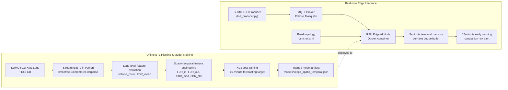

# VEEPS — Spatio-Temporal Edge AI for V2X Traffic Forecasting

<p align="left">
  
  
  
  
  
</p>

## Executive Summary

**VEEPS** (**V**2X **E**dge AI for **E**arly Traffic Congestion **P**rediction using **S**patio-Temporal Signals) is a graduation project that investigates how **distributed Edge AI** can be used to forecast traffic congestion **15 minutes in advance** in **Vehicle-to-Everything (V2X)** environments.

From a systems perspective, the project combines three major engineering layers:

- **Big Data ETL** for processing large-scale SUMO simulation outputs efficiently.
- **Machine Learning inference** using **XGBoost** with carefully designed **spatio-temporal features**.
- **Edge deployment** through **Dockerized RSU-like nodes** communicating over **MQTT** for real-time inference.

From a research perspective, the central hypothesis of VEEPS is that **congestion can be detected earlier through leading indicators rather than reactive speed measurements**. Therefore, the model **removes the current speed feature (`v_mean`) entirely** and instead relies on **Follower Distance Ratio (FDR)** across both **space** and **time** as the primary predictive signal. Under this formulation, the proposed model achieved **R² = 0.8919**.

---

## Abstract

Traditional traffic estimation pipelines often rely on instantaneous speed as a dominant predictor. While effective for describing current conditions, such signals are often **reactive** and can introduce **prediction bias** when the objective is **early warning**. VEEPS addresses this limitation by proposing a **spatio-temporal forecasting architecture** in which **FDR (Follower Distance Ratio)** is treated as a **leading indicator** of imminent congestion.

The project is built on top of large-scale **SUMO** simulation data and a production-inspired **V2X edge architecture**. A memory-efficient ETL pipeline based on **streaming XML parsing (`iterparse`)** transforms **13.6 GB** of raw FCD telemetry while keeping RAM usage **below 50 MB**. On top of the extracted lane-level data, the project engineers **spatial neighbor features** and **5-minute temporal memory features** for an **XGBoost** forecasting model. The trained model is then deployed inside a **Docker container** acting as a roadside unit (**RSU**) that consumes live telemetry from an **MQTT broker** and produces near-real-time congestion warnings.

The result is a compact but production-oriented prototype that connects **data engineering**, **machine learning**, and **distributed systems architecture** into one unified V2X forecasting workflow.

---

## Research Motivation

Early traffic intervention is more valuable than late-stage detection. Once average speed visibly collapses, congestion has often already formed and mitigation options become limited. This project is motivated by the idea that:

- **Microscopic vehicle interaction signals** can reveal congestion formation earlier than macroscopic traffic-speed indicators.
- **Edge-native inference** is better aligned with V2X deployment constraints than centralized-only architectures.
- **Scalable ETL** is essential when simulation or telemetry data grows to multi-gigabyte scale.

Accordingly, VEEPS explores whether a **spatio-temporal FDR representation**, executed on **distributed edge nodes**, can provide a practical and technically sound basis for **15-minute traffic forecasting**.

---

## System Architecture



---

## Methodology

### 1. Large-Scale Data Extraction

The input data consists of **SUMO Floating Car Data (FCD)** exported in XML format. Because the raw telemetry volume reaches **13.6 GB**, a conventional full-memory parsing strategy is not appropriate. VEEPS instead adopts a **streaming ETL design** using Python's **`iterparse`**, allowing the system to:

- sequentially process XML events,
- immediately extract relevant attributes,
- release parsed elements from memory, and
- maintain a nearly constant memory footprint.

This design is a core engineering contribution of the project because it transforms a potentially unstable preprocessing step into a **scalable and reproducible data pipeline**.

### 2. Feature Engineering Strategy

Instead of learning directly from instantaneous speed, the project explicitly removes **`v_mean`** to avoid overfitting to a reactive variable that becomes informative only after congestion is already visible.

The feature design centers around **FDR (Follower Distance Ratio)** and encodes two complementary dimensions:

- **Spatial dependency**: information from neighboring incoming and outgoing intersections/lane groups.
- **Temporal dependency**: a **5-minute memory window** that captures local traffic evolution.

The resulting spatio-temporal feature family includes:

- **`vehicle_count`**
- **`fdr_mean`**
- **`FDR_in`**
- **`FDR_out`**
- **`FDR_med`**
- **`FDR_std`**

### 3. Predictive Modeling

The forecasting model is implemented with **XGBoost**, chosen for its:

- strong tabular learning performance,
- robustness under heterogeneous feature interactions,
- practical training/inference efficiency, and
- suitability for deployment in constrained edge settings.

The target task is **15-minute-ahead congestion forecasting**, and the final model achieved:

- **R² = 0.8919**

This result supports the hypothesis that **FDR-driven spatio-temporal features** can act as reliable early signals for congestion prediction.

### 4. Edge Inference Architecture

For real-time operation, the trained model is packaged into a **Dockerized inference node** that behaves like an **RSU at the network edge**. Vehicle telemetry is streamed through **MQTT (Eclipse Mosquitto)**, enabling lightweight message-based communication between the producer and the edge processor.

At runtime, the edge node:

- subscribes to live telemetry,
- maps observations to road topology,
- maintains per-lane temporal history,
- reconstructs the spatio-temporal feature vector, and
- emits early congestion warnings.

---

## Key Engineering Achievements

### Memory-Efficient Big Data ETL

- Processed **13.6 GB** of XML telemetry with **streaming ETL**.
- Reduced memory usage from roughly **11 GB** to **below 50 MB**.
- Built a preprocessing pipeline suitable for **commodity hardware** and repeatable experimentation.

### Leakage-Aware ML Design

- **Completely removed `v_mean`** from the feature set.
- Reframed the forecasting problem around **leading indicators** instead of reactive signals.
- Demonstrated that **FDR-only spatio-temporal features** can still achieve strong predictive power.

### Production-Oriented Edge Deployment

- Containerized inference as an **RSU-like edge service**.
- Integrated **MQTT** for real-time telemetry transport.
- Designed a compact architecture that is easy to demonstrate, reproduce, and extend.

---

## Technical Highlights

- **Big Data**: streaming XML ETL with **`iterparse`** for large-scale SUMO outputs.
- **Machine Learning**: **XGBoost** with **spatio-temporal FDR features** only.
- **Bias Reduction**: explicit elimination of **current speed (`v_mean`)** from the model.
- **Edge Computing**: **Docker-based RSU runtime** for localized inference.
- **Messaging Layer**: **MQTT / Eclipse Mosquitto** for real-time V2X data flow.
- **Forecast Horizon**: **15-minute-ahead** congestion prediction.

---

## Repository Structure

```text
v2x-spatio-temporal/
├── data/
│   └── simulations/
│       ├── KichBan_1_TacNghenNang/
│       │   ├── fcd_producer.py
│       │   ├── build.bat
│       │   ├── run.bat
│       │   └── *.xml / *.sumocfg / *.rou.xml
│       ├── KichBan_2_TaiNan/
│       ├── KichBan_3_TacNghenNhe/
│       └── KichBan_4_GiaoThongThuaThot/
├── docker/
│   ├── Dockerfile
│   ├── docker-compose.yml
│   ├── mosquitto.conf
│   └── osm.net.xml
├── docs/
│   ├── features_importance.png
│   └── live_demo_terminal.png
├── models/
│   └── veeps_spatio_temporal.json
├── notebooks/
│   └── V2X_XGBoost1.ipynb
├── src/
│   ├── edge_processor.py
│   └── extract_csv.py
└── README.md
```

---

## How to Run

### Prerequisites

- **Docker**
- **Python 3.9+**
- **SUMO**
- Python dependencies for the producer:

```bash
pip install paho-mqtt
```

---

### 1) Clone the Repository

```bash
git clone https://github.com/LibraJeager/v2x-spatio-temporal.git
cd v2x-spatio-temporal
```

---

### 2) Start the MQTT Broker

```bash
docker network create veeps-net

docker run -d \
  --name v2x-broker \
  --network veeps-net \
  -p 1883:1883 \
  -v "$PWD/docker/mosquitto.conf:/mosquitto/config/mosquitto.conf" \
  eclipse-mosquitto:latest
```

---

### 3) Build and Run the RSU Edge AI Container

```bash
docker build -f docker/Dockerfile -t veeps-rsu docker

docker run --rm -it \
  --name rsu-node-a \
  --network veeps-net \
  -v "$PWD/src/edge_processor.py:/app/edge_processor.py" \
  -v "$PWD/docker/osm.net.xml:/app/osm.net.xml" \
  -v "$PWD/models/veeps_spatio_temporal.json:/app/veeps_spatio_temporal.json" \
  veeps-rsu
```

When the container starts successfully, it will:

- connect to **MQTT broker `v2x-broker:1883`**,
- load **`osm.net.xml`** as the spatial topology map,
- load the trained model **`veeps_spatio_temporal.json`**,
- maintain a **5-minute lane memory buffer**, and
- emit **early-warning alerts** when severe congestion is predicted.

---

### 4) Run the Producer to Stream Real-Time Vehicle Data

Example scenario:

```bash
cd data/simulations/KichBan_1_TacNghenNang
python fcd_producer.py
```

> **Important:** Update `BROKER_ADDRESS` inside `fcd_producer.py` to match your broker host.
>
> - Use **`localhost`** if the producer runs on the same machine as Docker.
> - Use your **host IP address** if the producer runs from another machine.

Published topic:

```text
v2x/telemetry/raw
```

Each message typically contains:

- **`timestep`**
- **`vehicle_id`**
- **`speed`**
- **`lane`**
- **`pos`**

---

### 5) Optional: Run SUMO Scenario Scripts

```bash
cd data/simulations/KichBan_1_TacNghenNang
run.bat
```

```bash
cd data/simulations/KichBan_1_TacNghenNang
build.bat
```

---

## Experimental Framing

This project is positioned as a **research-oriented engineering prototype** rather than only a demo application. It contributes across three layers:

1. **Data Layer** — scalable ETL for high-volume traffic telemetry.
2. **Model Layer** — leakage-aware spatio-temporal forecasting with interpretable tabular ML.
3. **System Layer** — real-time edge deployment for V2X-style congestion intelligence.

This combination makes VEEPS relevant to both:

- **academic evaluation** (method, hypothesis, feature design, result), and
- **software engineering assessment** (deployment, reproducibility, runtime integration).

---

## Future Work

- Extend from single-node inference to **multi-RSU cooperative forecasting**.
- Integrate **streaming analytics frameworks** such as Kafka or Redpanda.
- Add **online monitoring**, **concept drift detection**, and **model observability**.
- Benchmark against **LSTM**, **Temporal GNN**, and **Transformer-based** forecasting baselines.
- Expose predictions through a **dashboard** or **REST/gRPC API** for traffic operators.

---

## Author

**LibraJeager**  
Project — **VEEPS: Spatio-Temporal Edge AI for V2X Traffic Forecasting**

If this repository supports your research or engineering work, consider giving it a ⭐ on GitHub.
